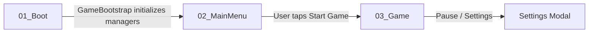

# Mini Market Tycoon 3D - Architectural & Technical Design Document

## 1. Project Overview
- **Project Name:** MINI MARKET TYCOON 3D
- **Target Platform:** Android (Portrait Orientation)
- **Engine / Pipeline:** Unity 6.3 LTS / Universal Render Pipeline (URP)
- **Performance Target:** Sustained 60 FPS on mid-range Android devices, scalable down to entry-tier devices.
- **Visual Style:** Realistic architectural proportions and supermarket lighting, mobile-optimized (no cartoon / low-poly flat shading).

---

## 2. Directory Hierarchy
The project adheres strictly to modular separation under `Assets/_Project/`:
```
Assets/
└── _Project/
    ├── Art/
    │   ├── Animations/
    │   ├── Audio/
    │   ├── Materials/
    │   ├── Models/
    │   ├── Textures/
    │   └── VFX/
    ├── Documentation/
    │   └── ARCHITECTURE.md
    ├── Editor/
    ├── Prefabs/
    │   ├── Characters/
    │   ├── Environment/
    │   ├── Gameplay/
    │   └── UI/
    ├── Resources/
    │   └── GameConfiguration.asset
    ├── Scenes/
    │   ├── 01_Boot.unity
    │   ├── 02_MainMenu.unity
    │   └── 03_Game.unity
    ├── ScriptableObjects/
    │   ├── Configuration/
    │   ├── Economy/
    │   ├── Products/
    │   └── Upgrades/
    ├── Scripts/
    │   ├── Audio/
    │   │   └── AudioManager.cs
    │   ├── Core/
    │   │   ├── ConfigurationManager.cs
    │   │   ├── EconomyConfiguration.cs
    │   │   ├── GameBootstrap.cs
    │   │   ├── GameConfiguration.cs
    │   │   ├── GameManager.cs
    │   │   ├── GameStateManager.cs
    │   │   ├── QualityManager.cs
    │   │   ├── SceneLoader.cs
    │   │   └── StoreConfiguration.cs
    │   ├── Customers/
    │   ├── Economy/
    │   │   ├── CurrencyManager.cs
    │   │   └── UpgradeData.cs
    │   ├── Gameplay/
    │   │   ├── CameraController.cs
    │   │   └── MarketEnvironmentBuilder.cs
    │   ├── Input/
    │   │   └── InputManager.cs
    │   ├── Save/
    │   │   ├── SaveDataModels.cs
    │   │   └── SaveManager.cs
    │   ├── Store/
    │   │   └── ProductData.cs
    │   ├── UI/
    │   │   ├── BootLoadingView.cs
    │   │   ├── GameHUDView.cs
    │   │   ├── MainMenuView.cs
    │   │   ├── SettingsPopupView.cs
    │   │   └── UIManager.cs
    │   └── Utilities/
    │       ├── CurrencyFormatter.cs
    │       ├── MonoBehaviourSingleton.cs
    │       └── SafeAreaFitter.cs
    ├── Settings/
    │   ├── MobileURPAsset.asset
    │   └── MobileURPAsset_Renderer.asset
    └── Tests/
```

---

## 3. Core Architecture & Lifecycles
All core systems run on clean, decoupled patterns using `MonoBehaviourSingleton<T>` with `DontDestroyOnLoad` support:
1. **`GameBootstrap`**: Execution entry point in `01_Boot`. Initializes singletons in strict dependency order, avoiding race conditions.
2. **`GameManager`**: Persistent coordinator for high-level runtime events, application pause/resume, and offline idle calculations.
3. **`GameStateManager`**: State machine controlling transitions between `Boot`, `MainMenu`, `Loading`, `Playing`, `Paused`, `GameOver`, and `Saving`.
4. **`SceneLoader`**: Asynchronous scene loading with progress reporting, smooth visual pacing, and automated state synchronization.
5. **`ConfigurationManager`**: Centralized runtime provider for ScriptableObjects (`GameConfiguration`, `EconomyConfiguration`, `StoreConfiguration`), eradicating hard-coded values.
6. **`CurrencyManager`**: High-precision `double` cash balance management, event notifications (`OnCurrencyChanged`), affordability validation, and save pipeline integration.
7. **`SaveManager`**: Local JSON persistence using atomic file replacements (`.tmp` write then swap) to eliminate save corruption risks. Includes versioning (`CURRENT_SAVE_VERSION`) and automated schema migration.
8. **`QualityManager`**: Scalable graphics presets (`Low`, `Medium`, `High`, `Ultra`) controlling shadow distance, texture mipmap limits, MSAA, and locking target framerate to 60 FPS.
9. **`InputManager`**: Unified gesture layer supporting mobile touch (1-finger pan, 2-finger pinch zoom, tap) and Editor mouse fallback, with UI blocking (`EventSystem.IsPointerOverGameObject`).
10. **`CameraController`**: 3D hybrid isometric/third-person camera tailored for portrait mobile screens, with dampening, boundary clamping, and zoom limits.
11. **`UIManager` / `SafeAreaFitter`**: Adaptive UI hierarchy that automatically anchors within device safe area cutouts and notches.

---

## 4. Architectural Proportions (1 unit = 1 meter)
- **Market Floor**: 14m (width) x 20m (depth) x 0.2m (thickness)
- **Exterior Sidewalk**: 18m x 6m
- **Store Walls**: 3.5m height, 0.3m thickness, central 4m entrance gap
- **Sliding Glass Doors**: 1.9m width x 2.4m height each (4m opening)
- **Aisle Shelves**: 1.4m width x 1.8m height x 0.6m depth (3-tier realistic supermarket gondola)
- **Cashier Counter**: 2.2m length x 0.9m height x 0.8m depth, with cash register POS terminal

---

## 5. Scene Flow

